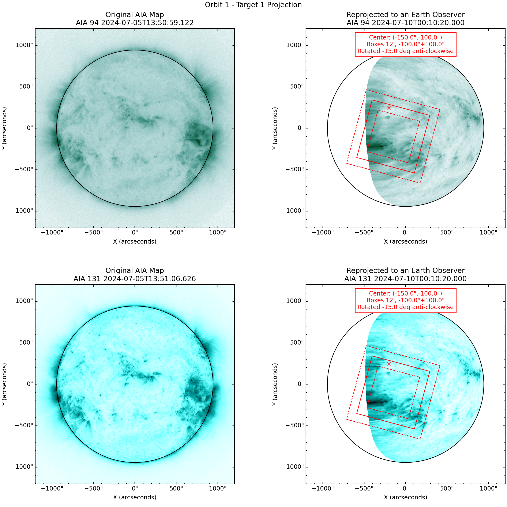

# nustar_planning
Reprojecting AIA and STEREO images to use as a guide for NuSTAR observations to then get RA/Dec and PA angle values for a given future observation time.

# Installation
Git clone the repository:
> git clone https://github.com/masek014/nustar_planning.git

Go to directory and install using the following command:
> pip install -e .

# Example
There is an example Jupyter notebook in the "examples" directory.

[Example report](examples/planner_example/planner_example.pdf)

Example projection image:

